# SELabEXP3
| نام          | شماره دانشجویی|
| ------------- | ------------- |
| علیرضا عالیپناه                  | 99106396      |
| سیدمحمدیوسف نجفی      | 99102361      |
| علی نظری                        | 99102401      |

در این آزمایش در گام نخست باید پروژه 
library
داده شده را آماده اجرا می‌کردیم تا در ادامه ایرادهای آن را رفع کنیم و تست‌های مربوطه را هم برای آن بنویسیم.

در گام نخست یک پروژه جاوا ساخته شد و 
junit
به نیازمندی‌های آن اضافه شد:

  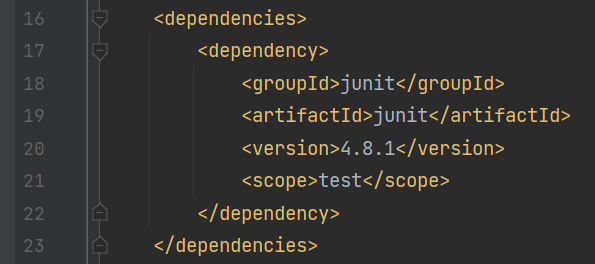

سپس ساختار کلی پروژه‌ای که اشاره شده است را ایجاد می‌کنیم:

  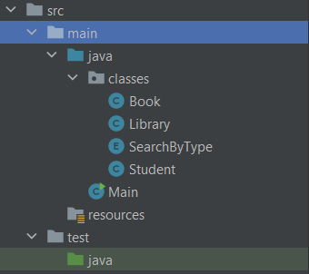

حال برای پیدا کردن خطاها، شروع به نوشتن تست می‌کنیم. اولین تست را برای تابع
lend book 
می‌نویسیم. تست نوشته شده به این شکل است:

  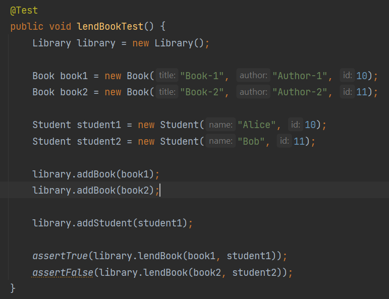

در این تست دانشجو دوم در کتابخانه ثبتنام نکرده است و انتظار داشتیم که 
False
برگردانده شود ولی نتیجه تست به این شکل شد:

  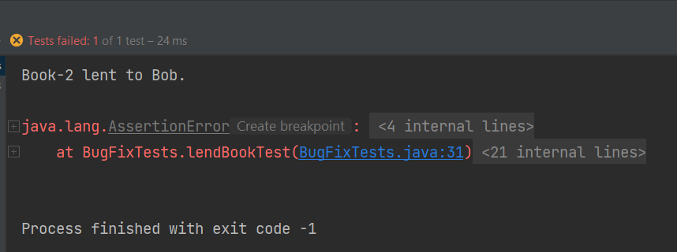

که همانطور که دیده می‌شود، انجام نشده است و اکسپشن پرتاب شده است که نادرست است.

حال تابع نام برده را به شکل زیر تغییر می‌دهیم تا این مشکل حل شود:

  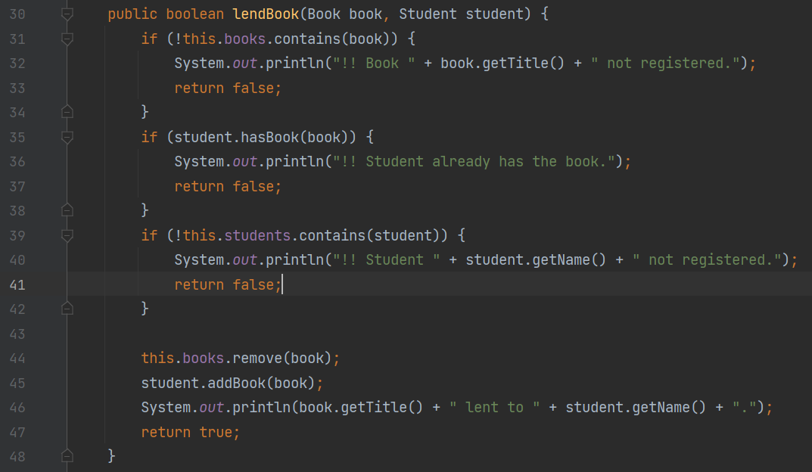

که خط 39 تا 41 جدید است و چک می‌کند دانشجو در کتابخانه هست یا نه و با این تغییر، نتیجه تست به شکل زیر می‌شود:

  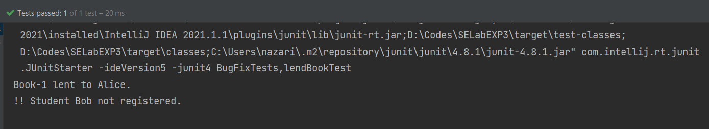

که همانطور که مشخص است، تست پاس شده است و مشکل برطرف شده است.

برای مشکل بعدی، برای 
return book 
تصمیم گرفتیم که تست بنویسیم که تست نوشته شده به شکل زیر است:

  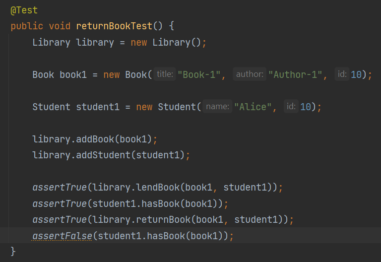

دی این سناریو یک دانشجو یک کتاب قرض می‌گیرد و تست می‌کنیم که کتاب را دانشجو داشته باشد بعدش و بعد از پس دادن کتاب هم انتظار داریم که دانشجو دیگر کتاب را نداشته باشد که بعد از ران به این نتیجه می‌رسیم:

  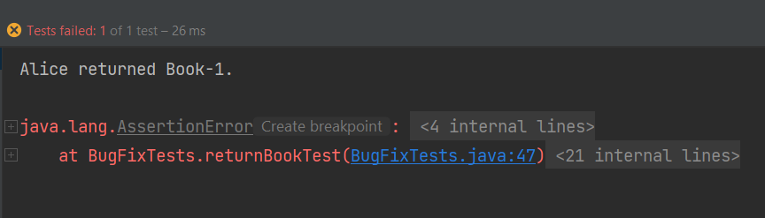

که می‌بینیم مورد آخر ارور خورده است. کد را که چک کنیم می‌بینیم کتاب بعد از پس دادن از دارایی‌های دانشجو کم نمی‌شود. پس کد را به شکل زیر تغییر می‌دهیم:

  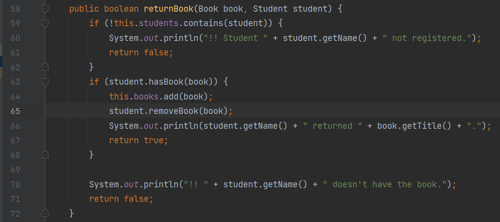

که خط 65 جدید است. و بعد از این تغییر، نتیجه تست به شکل زیر می‌شود:

  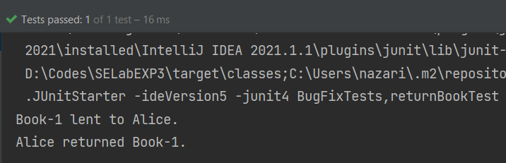

پس هر دو مشکل را با تست درآوردیم و حل کردیم.

برای گام بعد که پیاده‌سازی قابلیت سرچ است، در 
TDD
اصلی به این شکل بود که اول باید
compile error 
می‌خوردیم و بعد تازه کلاس‌ها و ... مورد نیاز را ایجاد می‌کردیم ولی در این حالت چون همه موارد از پیش آماده بوده است، امکان انجام این مرحله وجود ندارد و نخست تست‌هایی می‌نویسیم که ارور رانتایم بخورند و تکه تکه مشکلات را رفع می‌کنیم. 

برای سرچ کتاب، تست نوشته شده به شکل زیر است در درجه اول:

  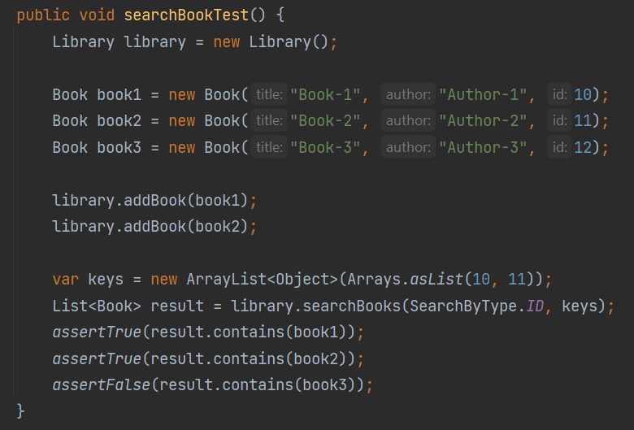

حال در درجه اول این تست را ران کنیم، نتیجه به شکل زیر می‌شود:

  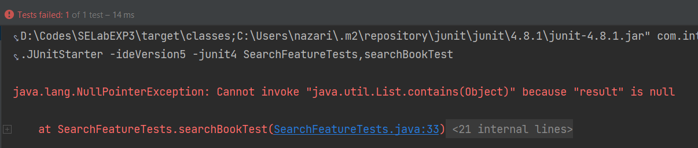

که منطقی هم هست چون پیاده‌سازی‌ای نداریم. حال مینیمال‌ترین پیاده‌سازی ممکن را انجام می‌دهیم که تست صرفا پاس شود که پیاده‌سازی به شکل زیر است:

  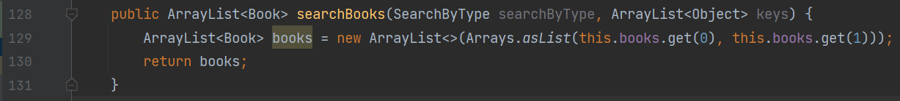

ولی همانطور که انتظار می‌رود، این پیاده‌سازی درست نیست و یک تست دیگر می‌نویسیم که این مورد را نشان دهد:

  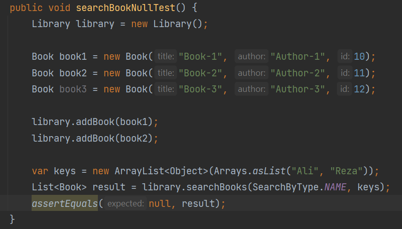

که نتیجه ران شدن تست به شکل زیر است:

  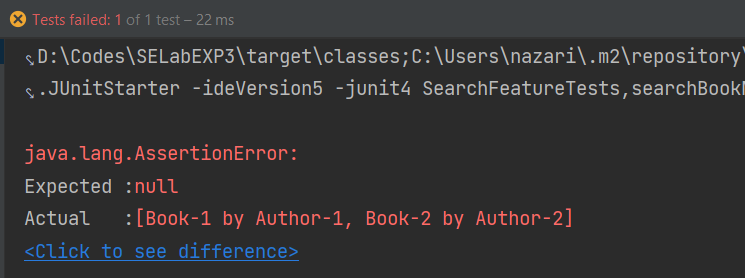

و می‌فهمیم پیاده‌سازی باید عوض شود که در نهایت پیاده‌سازی به شکل زیر می‌شود:

  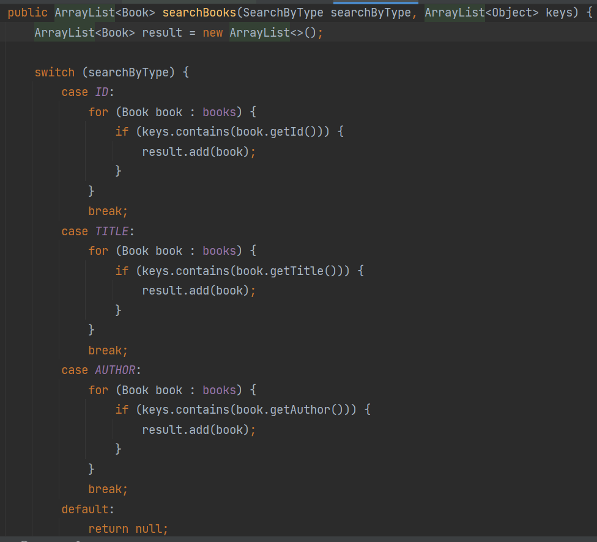

و با این کد هر دو تست به درستی ران می‌شود و پاس می‌شود:

  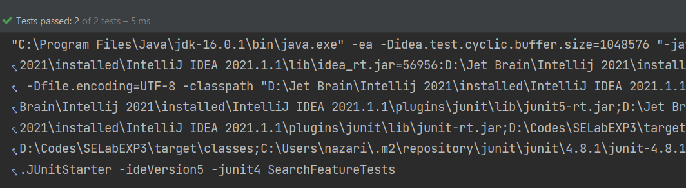

ولی این کد می‌تواند ریفکتور شود و 
duplicate code
موجود است در آن و یکی از گام‌های 
TDD
هم همین مورد است و برای همین تست‌ها به شکل زیر می‌شود:

  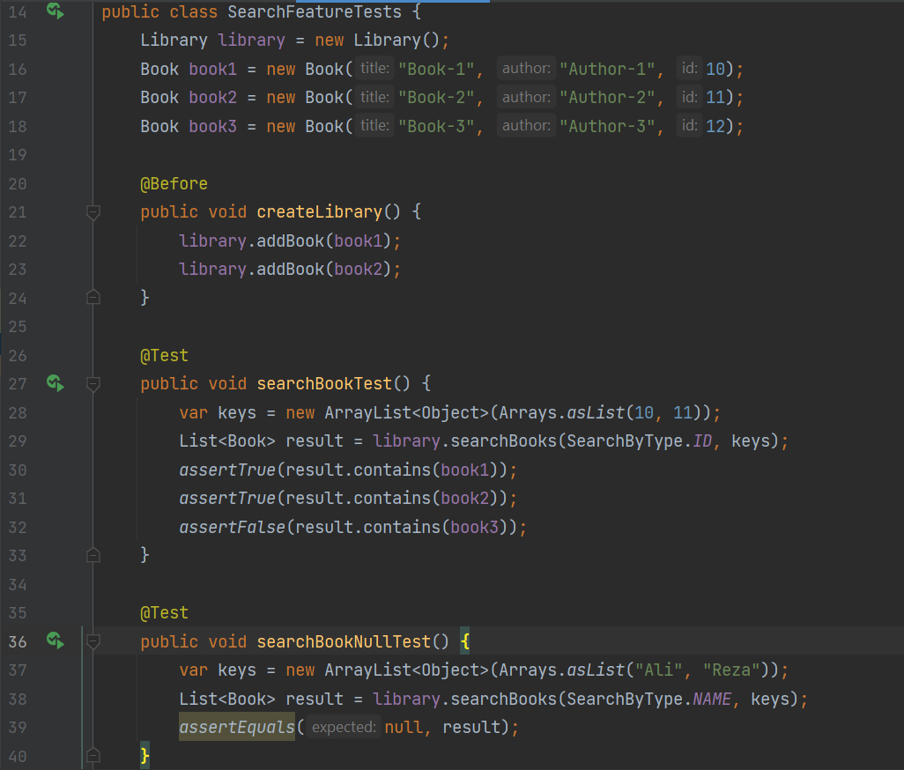

که بسیار بهتر شده است و دیگر
duplicate code
نداریم. به این ترتیب یک چرخه برای TDD انجام می‌شود.

دقیقا همین مراحل را برای سرچ دانشجو هم انجام می‌دهیم و صرفا عکس‌های آن را قرار می‌دهم و همه مرحله‌ها را دقیق نمی‌گذاریم زیرا دقیقا مانند سرچ کتاب است و مورد اضافه‌تر و جدیدتری ندارد.

  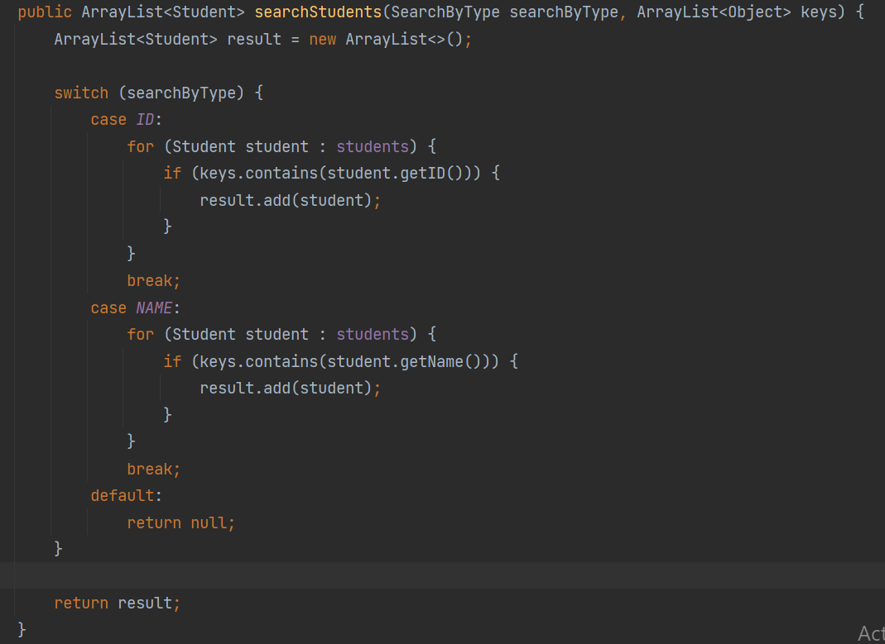

  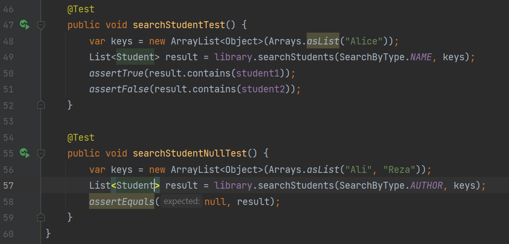

 

  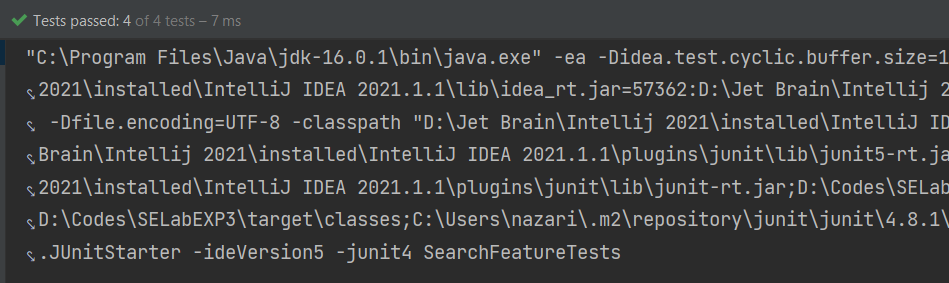

و به این ترتیب این بخش از آزمایش کامل می‌شود.

حال به این می‌پردازیم که از ابزار های تست برای بررسی دقیق کاورج استفاده کنیم.

